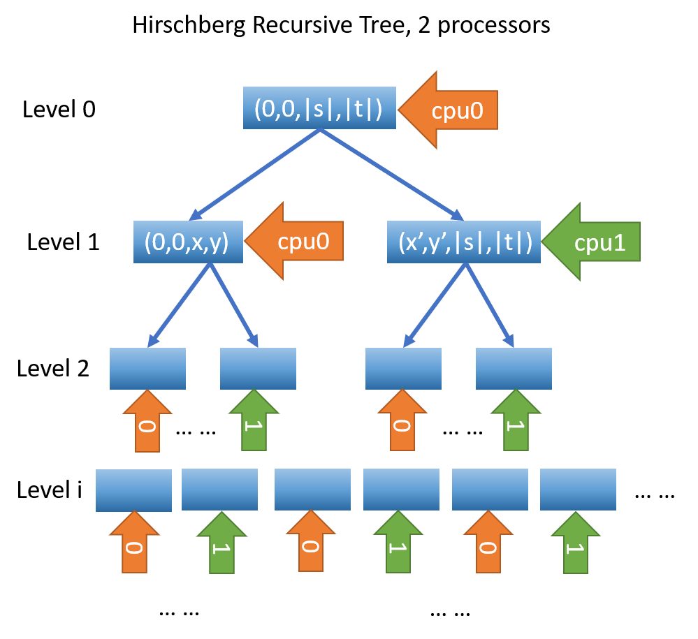
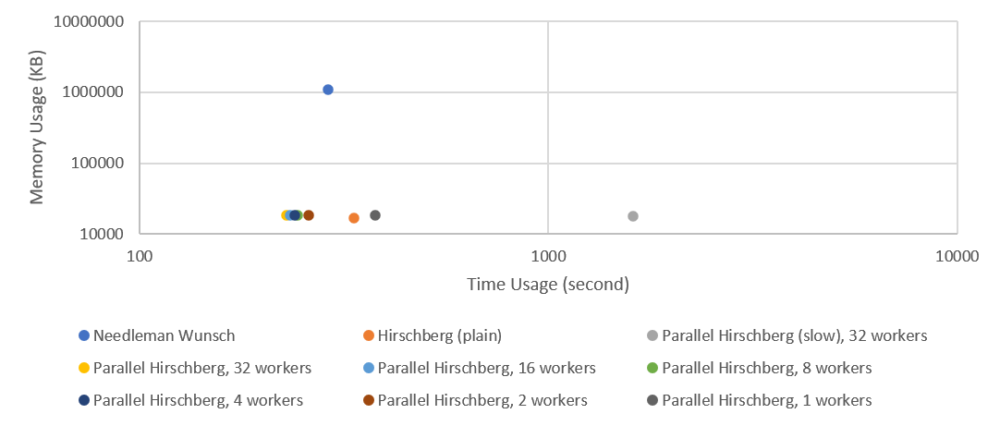

This is the github repo for Wenda Qiu's CS466 project: Parallel Hirschberg Algorithm. Multiprocessing is used to compute Hirschberg states at each level. Below is an example for 2 processors.



This is the results for experiemnts. The speed up is negligible for more than 4 cores.



---

# File Description
* <tt>Hirschberg.py</tt> The implementation for plain Hirschberg.
* <tt>main.py</tt> The code for experiments. Also served as an example usage.
* <tt>NeedlemanWunsch.py</tt> The implementation for Needleman Wunsch algorithm, which is used as ground truth.
* <tt>ParallelHirschberg.py</tt> The implementation for parallel Hirschberg using approach on recursion acceleration.
* <tt>ParallelHirschberg\_failed.py</tt> The implementation for parallel Hirschberg using approach on DP acceleration, which turns out to be not effective.
* <tt>input.txt</tt> The input file for time benchmarks of 10 sequence pairs of length 5,000.
* <tt>logs.txt</tt> The logs for experiment commands. 

# Requirement

This project requires tqdm and python3.6+.

# How to Use

```python
import ParallelHirschberg
import ParallelHirschberg_failed
import NeedlemanWunsch
import Hirschberg

# Prepare sequences and delta
keys = ['A', 'C', 'T', 'G', '-']
delta = {}
for i in range(len(keys)):
    delta[keys[i]] = {k: v for (k, v) in zip(keys, [1 if keys[i] == keys[j] else -1 for j in range(len(keys))])}
s, t = "TAGATA", "GTAGGCTTAAGGTTA"
    
# Run Parallel Hirschberg
out1 = ParallelHirschberg.Hirschberg(s, t, delta, num_workers=4) # Parallel Hirschberg Approach 2

# Run Parallel Hirschberg (slow)
out2 = ParallelHirschberg_failed.Hirschberg(s, t, delta, num_workers=4) # Parallel Hirschberg Approach 1 (failed)

# Run Hirschberg (plain)
out3 = Hirschberg.Hirschberg(s, t, delta) # Plain Hirschberg

# Run NeedlemanWunsch
ans = NeedlemanWunsch.global_align(s, t, delta) # Needleman-Wunsch as ground truth

assert ans[0] == out1[0] == out2[0] == out3[0] # The scoring should be the same
print(out1[0]) # The alignment score
print(out1[1]) # The alignment in the format of 2 lines of string
```

The output should be
```
-3
-TAG----A---T-A
GTAGGCTTAAGGTTA
```

# Reproduce Experiments

```bash
# Stress test
/usr/bin/time -v python main.py --task stress

# Run Parallel Hirschberg with 32 processors on input.txt
/usr/bin/time -v python main.py --task run_phb --num_workers 32

# Run Hirschberg (plain) on input.txt
/usr/bin/time -v python main.py --task run_hb

# Run Parallel Hirschberg (slow) with 32 processors on input.txt
/usr/bin/time -v python main.py --task run_phb_failed --num_workers 32

# Run NeedlemanWunsch on input.txt
/usr/bin/time -v python main.py --task run_nw
```

